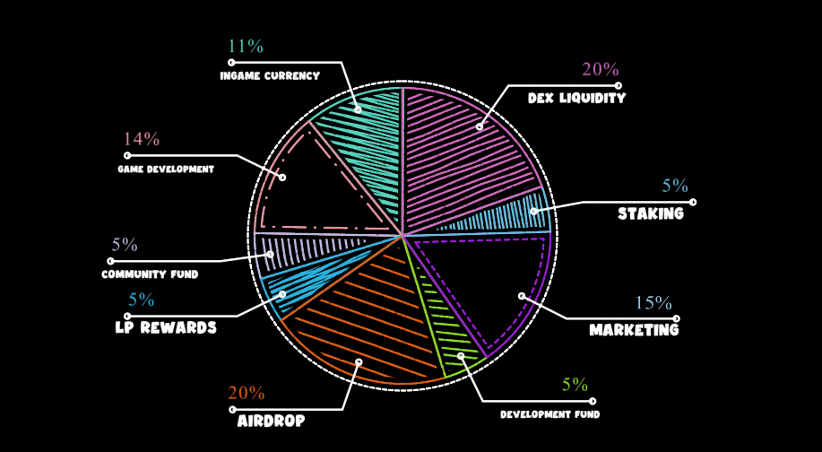

# Tokenomics


$COOT token allocation


<figure><figcaption></figcaption></figure>

|                  |     |                                                                                                                     |
| ---------------- | --- | ------------------------------------------------------------------------------------------------------------------- |
| Ingame Currency  | 11% | Coin allocated to be used in-game                                                                                   |
| Game Development | 14% | Funds to help development and add new features to our p2e game                                                      |
| Community Fund   | 5%  | Funds allocated to the community, such as fundraisers, charity, partnerships or any other special community events. |
| LP Rewards       | 5%  | Liquidity pool rewards                                                                                              |
| Airdrop          | 5%  | Initial and future airdrop allocation.                                                                              |
| Development Fund | 5%  | Development costs of building aplications.                                                                          |
| Marketing fund   | 15% | Funds allocated to help promote and feature the cooties ecosystem.                                                  |
| Staking          | 20% | Coin allocated to Staking for 10 years                                                                              |
| Dex Liquidity    | 20% | Liquidity funds allocated to providing liquidity and or any listing fees.                                           |
