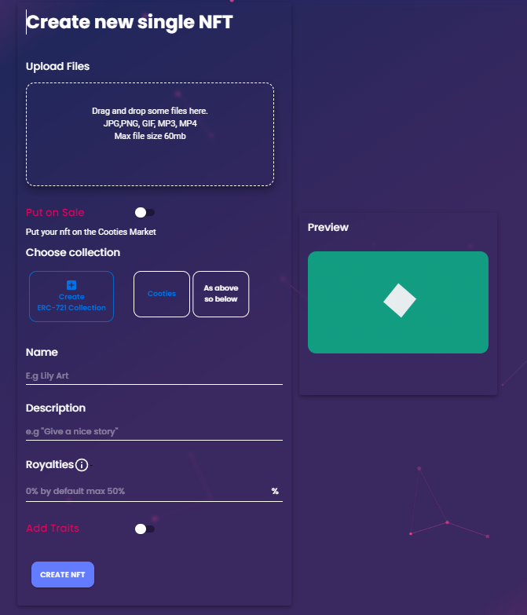
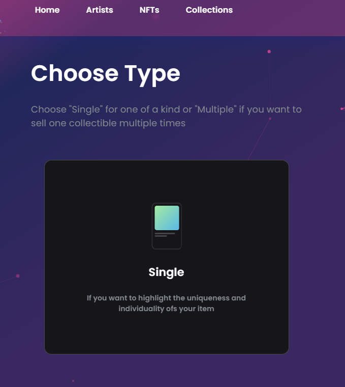
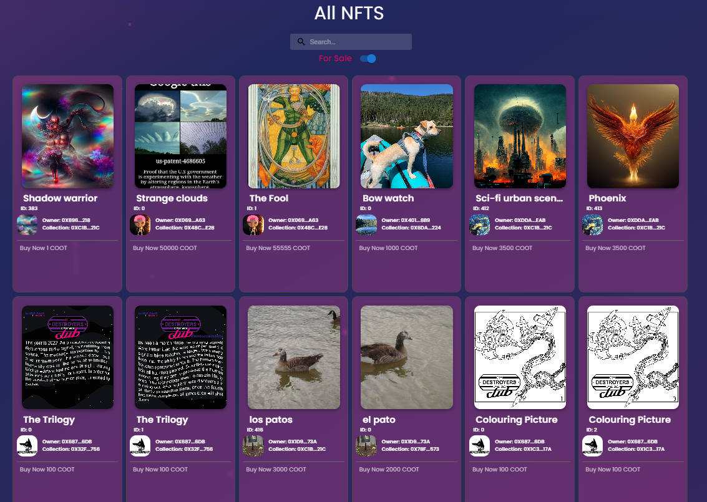

# 🛒 Cootie Mart



<figure><figcaption></figcaption></figure>

Cootie Mart is a Decentralized NFT marketplace running on Songbird and The Flare network\
With XRPL being added.

Cootie Mart Features a Codeless Mint system, where users can upload entire collection of NFTs to be sold or traded on Flare, Songbird and the XRPL Network.

Cootie Mart is Currently in Alpha phase of testing and is yet to be officially launched.\
\
official Launch Date is set for January 9th 2023

<figure><figcaption>
Create a collection
</figcaption></figure>

 

<figure><figcaption>
Choose between ERC-721 and ERC-1155
</figcaption></figure>

cootie Mart has the ability to upload any JPG, PNG, and GIF files too the Songbird Network.\
You then can create a collection to store the NFTS in. \
You can add traits and royalties to your NFTs with more features being added.

<figure><figcaption></figcaption></figure>
