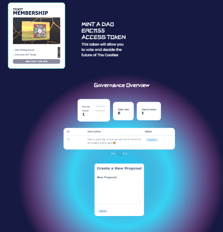

# 🗳 DAO



A decentralized autonomous organization (DAO), sometimes called a decentralized autonomous corporation (DAC), is an organization constructed by rules encoded as a computer program that is often transparent, controlled by the organization's members and not influenced by a central government.

<figure><figcaption>
DAO landing page
</figcaption></figure>

Users can purchase a Gold DAO card from [https://cootie.finance/dao](https://cootie.finance/dao)\
This NFT is an ERC-1155 NFT that grants access to Vote and make proposals in regards to the Cooties Ecosystem. \
This DAO is currently in Alpha phase testing and is not official yet.


