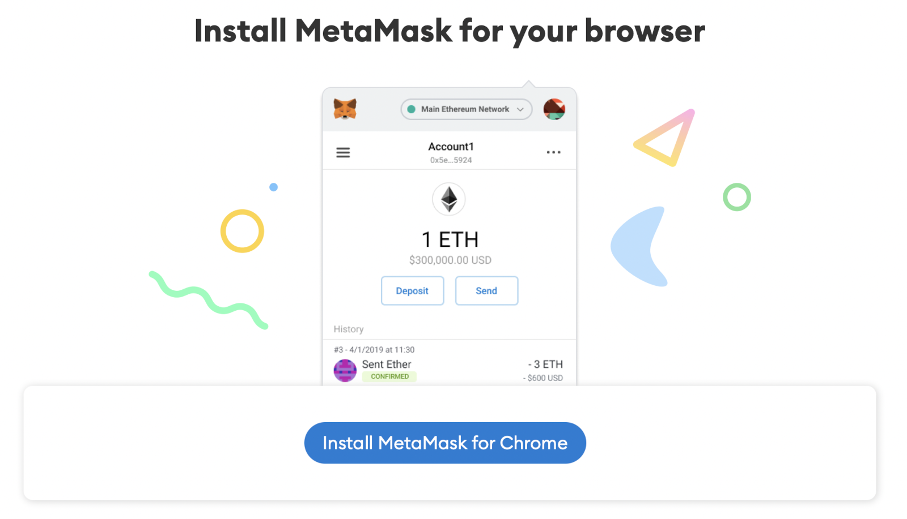
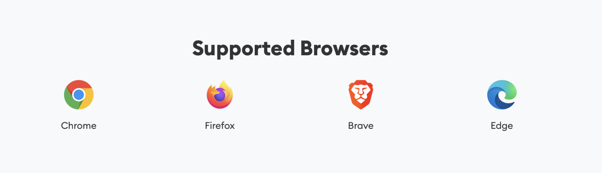
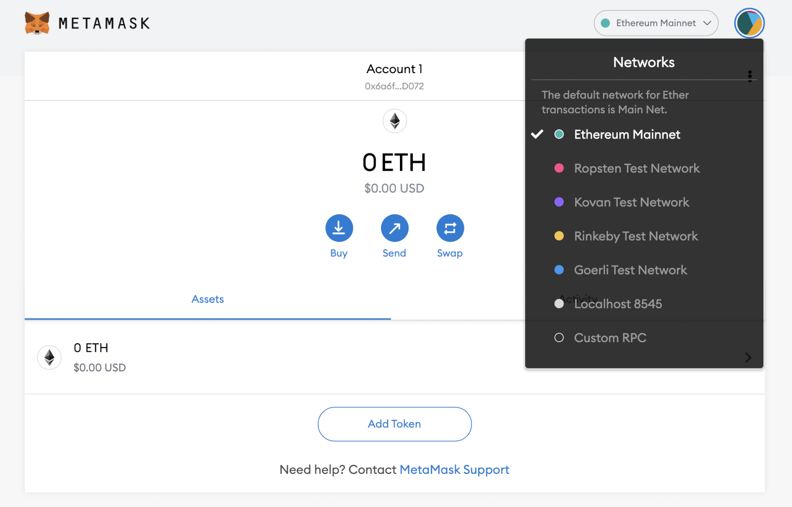
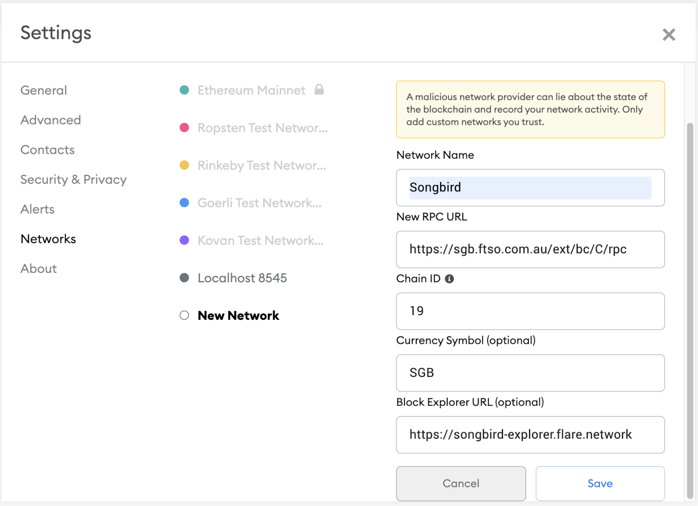

# 🦊 Add Songbird to Metamask

### Configuring MetaMask Wallet For Songbird Network | Flare Network

If you used an ETH address from a MetaMask wallet, you can access your $SGB tokens by connecting to the Songbird Network directly in MetaMask, by following the steps outlined below.

If you haven’t already got [Metamask](https://metamask.io/) installed, you’ll need to download it [here](https://metamask.io/).

<figure><figcaption></figcaption></figure>

Available as a browser extension and as a mobile app, MetaMask equips you with a key vault, secure login, token wallet, and token exchange — everything you need to manage your digital assets.

**PC or MAC Instructions**

Metamask is supported on the following browsers … we’re using Chrome for this demo

<figure><figcaption></figcaption></figure>

Once installed, you’ll need to import the wallet you’ve previously created.

When you’ve successfully added your wallet, select the drop down in the top right hand corner, currently set to “Ethereum Mainnet”.

You need to select “Custom RPC” at the bottom of the list.

<figure><figcaption></figcaption></figure>

Once selected you’ll be prompted to complete the following fields.

Network Name: Songbird\
New RPC URL: https://sgb.ftso.com.au/ext/bc/C/rpc\
Chain ID: 19\
Currency Symbol (optional): SGB\
Block Explorer URL (optional): https://songbird-explorer.flare.network/

<figure><figcaption></figcaption></figure>

Your dialog box should now look like this, then hit save.

You’ll now see Songbird in the top right hand corner which will mean you’ve successfully set up the Songbird Network and your Metamask Wallet.

The Songbird wallet will display and show your $SGB token amount.

While still in the “Assets” tab, scroll to the bottom and select “Add Token” so you can add $WSGB.

In the address field you need to enter: 0x02f0826ef6aD107Cfc861152B32B52fD11BaB9ED

The Token Symbol and Token Decimal will automatically populate with WSGB and 18. Click “Next” then “Add Tokens”.

If you select “Songbird” you’ll see a dropdown box where you can change between networks as required.

**iPhone App Instructions**

The process will be just the same for setting it up on an iPhone.

When the app has been installed and you’ve imported your wallet you’ll need to select the 3 horizontal bars in the top left hand corner.

From there you’ll select Settings > Networks > Add Network and fill out the following fields.
