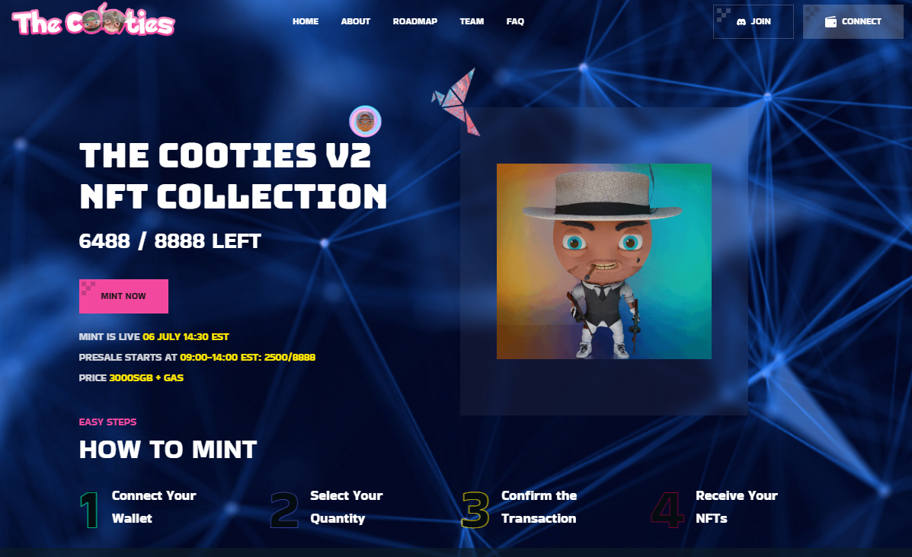
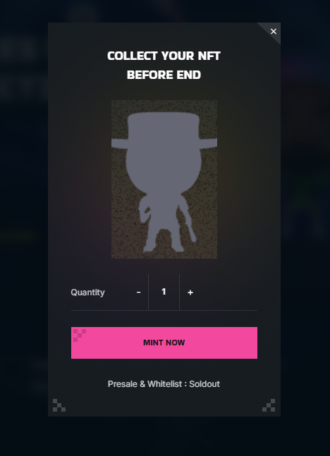

# 🪙 How to mint a CootieV2

<figure><figcaption></figcaption></figure>

Step 1: Navigate to the top right and sign in using your preferred web3 wallet.\
Metamask works best.\
\
Step 2: Click The Pink Mint button to bring up the minting module.\
here you will select hopw many NFTS you want to mint.\
after clicking "MINT NOW" your wallet ask to confirm the transaction, click yes.\
you have now successfully minted a V2 Cootie!

<figure><figcaption></figcaption></figure>

After signing in a button on the top right will appear titled "My Cooties" here you will be able to see and trade your Cootie NFTS.\
to trade the NFT click the arrow to the right of your Cootie # and enter the songbird address.

<figure><figcaption></figcaption></figure>
