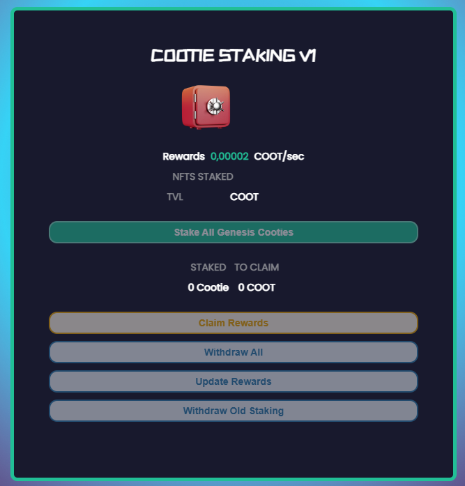

# 🎁 Staking

<figure><figcaption>
3 Staking options
</figcaption></figure>

$COOT Staking.\
Users will be able to compound their $COOT to earn $COOT!\

<figure><figcaption></figcaption></figure>

Genesis Cootie V1 Staking.\
This staking module is currently in beta testing with subject to change. users can earn up to 0.00002 COOT per NFT each second. \
\
If you you were staked in original staking Dapp, users can click the "withdraw all" button to un-stake from the older contract and re-stake to the new. This will pull up a wallet transaction request for each NFT staked. Could take awhile depending on how many NFTS you had staked in the old contract.

<figure><figcaption></figcaption></figure>

Cooties staking v2\
this module allows users to stake their V2 Cooties to earn up to 0.00004 COOT per NFT every second.

<figure><figcaption></figcaption></figure>
